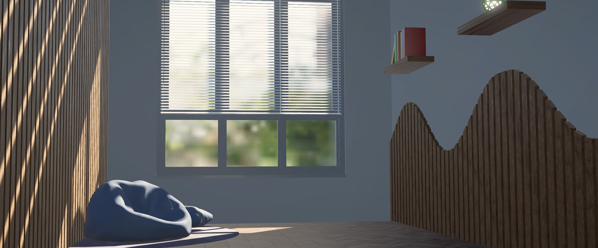

UnitySSGIURP
=============
 
 Screen Space Global Illumination for Unity URP (Universal Render Pipeline).
 
 **Please read the Documentation and Requirements before using this repository.**
 
Screenshots
------------
**Relaxing Corner**
 
Available in the samples page:
 
 
 
 
 
Installation
------------
- Please refer to [Unity's documentation page](https://docs.unity3d.com/Manual/upm-ui-giturl.html).
- Open the **Package Manager** and select **Add package from git URL** from the add menu.
- Enter **https://github.com/jiaozi158/UnitySSGIURP.git** to install this package.
- If Unity could not find **git**, consider installing it [here](https://git-scm.com/downloads).
- Add the **Screen Space Global Illuminaton** renderer feature into the active URP renderer.
- Add the **Lighting/Screen Space Global Illuminaton (URP)** override to the scene's Volume.
 
Documentation
------------
- [In Progress](./Documentation~/Documentation.md)
 
Requirements
------------
- Unity 2022.3 and URP 14 or above.
- Shader model 3.5 or above (at leaset OpenGL ES 3.0 or equivalent)
- [Extra steps](https://github.com/jiaozi158/UnitySSPathTracingURP/blob/main/Documentation/ForwardPathSupport.md#opengl-platforms-extra-setup) are needed for OpenGL APIs.
 
Reminders
------------
- This is an initial release and some unresolved issues are expected due to lack of time for testing.
- Please open an issue if anything went wrong.
- Orthographic projection and VR support will be added in the future release.
 
License
------------
MIT

